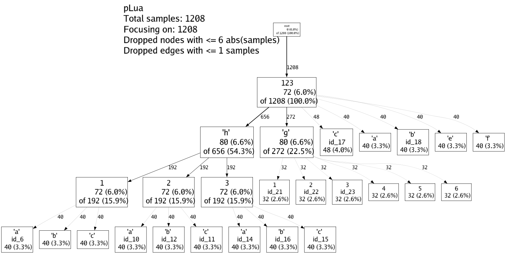

# mLua
Lua的内存优化管理工具

## 特性
* 将Lua的内存如配置表固化到C++中，并无需修改Lua使用的代码，以减少Lua的内存占用提高Lua的GC效率（参考自云风的[lua-conf](https://github.com/cloudwu/lua-conf)）
* 静态分析Lua Table的内存占用，输出gperftools格式图片或者火焰图
* 动态分析Lua全局内存分布，输出各个节点的内存占用

## 使用方法
#### 编译源码
```shell
# mkdir build
# cd build
# cmake ..
# make -j8
```
#### Lua表固化C++
1. 执行将Lua的内存如配置表固化到C++中的测试
```shell
# cd test
# lua test_cpp_table.lua
```
2. 查看测试结果，可以看到Lua的内存占用从161479降到了34，即便在使用C++的table后，Lua的内存占用有所回升，但也停留在1150
```shell
...
before lua table to cpp, lua memory is 161479.23925781
...
after lua table to cpp, lua memory is 34.1533203125
...
after use cpp table, lua memory is 1150.0283203125
```
#### 可视化分析Lua Table的内存占用
1. 执行分析Lua Table的内存占用的测试
```shell
# cd test
# lua test_perf.lua
```
2. 使用tools的工具，生成gperftools风格的图片和火焰图
```shell
# cd tools
# go mod tidy
# go build png.go
# go build plua.go
# ./show.sh ../test/
```
3. 查看生成的图片


#### 动态分析Lua全局内存分布
1. 执行分析Lua全局内存分布的测试
```shell
# cd test
# lua test_memory_walker.lua
```
2. 查看结果。可以看到执行了72步，统计分析出了总内存以及各个节点的内存占用
```shell
memory walker open ok
---------step 1 done---------
...
memory walker memory_walker_stack pop .data.package.b size 128
memory walker all end size 1552 cardinality 7 max 15061600 min 14977424 bytesize 50 usetime 0
memory walker stop ok
---------step 72 done---------
```

## 其他
[lua全家桶](https://github.com/esrrhs/lua-family-bucket)
