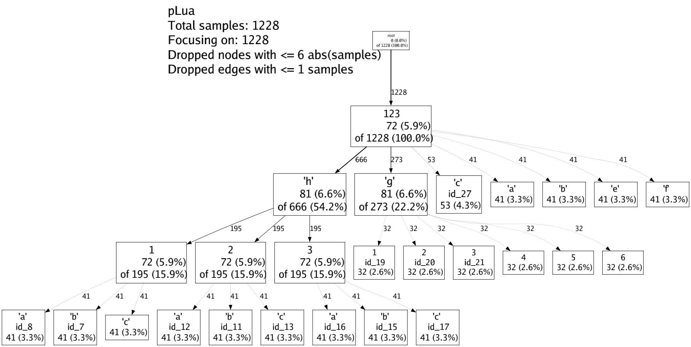
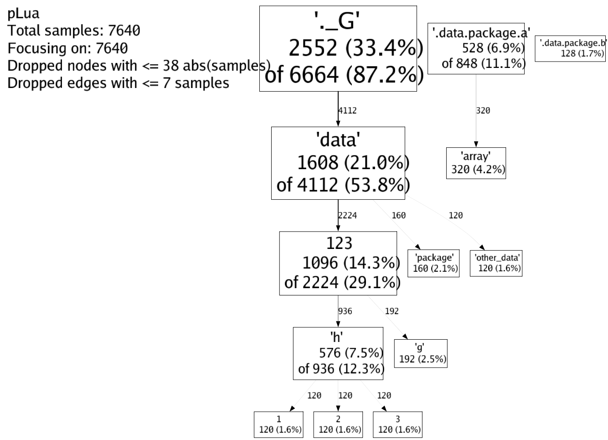

# mLua
Lua的内存优化管理工具

## 特性
* 使用Protobuf定义数据结构，将Lua的Table结构固化到C++中，减少内存占用和GC压力
* 分析Lua的内存占用，输出gperftools格式图片或者火焰图，分为静态分析和动态分析
* 快速序列化和反序列化Lua的Table

## 使用方法
#### 编译源码
```shell
# mkdir build
# cd build
# cmake ..
# make -j8
```

#### 编译tools
```shell
# cd tools
# go mod tidy
# go build png.go
# go build plua.go
```

#### Lua内存固化C++
1. 执行将Lua的内存如配置表固化到C++中的测试脚本
```shell
# cd test
# lua test_cpp_table.lua
```
2. 输入选项查看测试结果，可以在操作系统看不同benchmark下的内存占用对比
```shell
  1: test_get_set
  2: test_benchmark_lua_simple
  3: test_benchmark_cpp_simple
  4: test_benchmark_lua_map
  5: test_benchmark_cpp_map
  6: test_benchmark_lua_array
  7: test_benchmark_cpp_array
```

#### 静态内存占用分析
1. 执行静态分析的测试脚本
```shell
# cd test
# lua test_static_perf.lua
```
2. 使用tools的工具，生成gperftools风格的图片和火焰图
```shell
# ./show.sh ../test/
```
3. 查看生成的图片


#### 动态内存占用分析
1. 执行分析Lua全局内存分布的测试
```shell
# cd test
# lua test_dynamic_perf.lua
```
2. 使用tools的工具，生成gperftools风格的图片和火焰图
```shell
# ./show.sh ../test/
```
3. 查看生成的图片


#### 序列化和反序列化
1. 执行序列化和反序列化Lua的Table的测试
```shell
# cd test
# lua test_quick_archiver.lua
```
2. 查看结果。可以看到序列化和反序列化的结果是一致的，并且对于内存的占用也是很小的
```shell
save old data len:      441
is equal: true
init lua mem KB:        86.9228515625
after init data, lua mem KB:    1716.734375
save data len:  177358
after save data, lua mem KB:    379.5
after load data, lua mem KB:    1488.984375
```

## 其他
[lua全家桶](https://github.com/esrrhs/lua-family-bucket)
