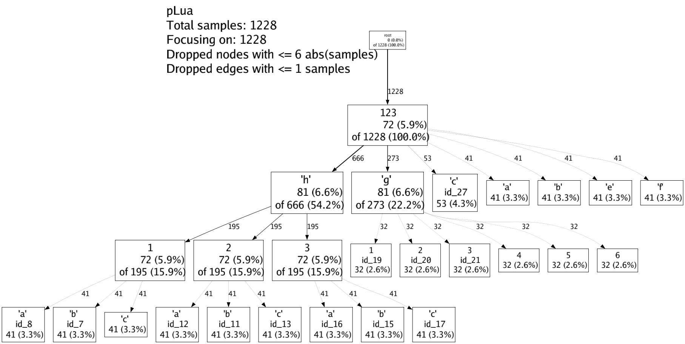
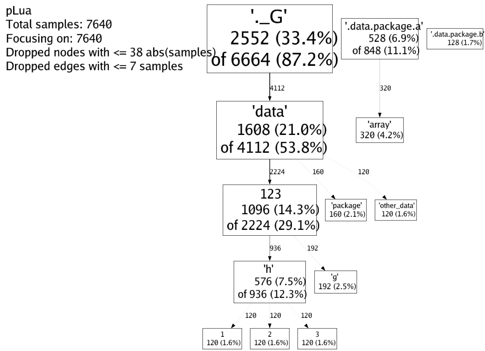

# mLua

[](https://github.com/esrrhs/mLua)
[](https://github.com/esrrhs/mLua)
[](https://github.com/esrrhs/mLua/actions)

> **A Lua memory optimization toolkit: protobuf-backed C++ tables, memory profiling, and fast table serialization.**

[English](README.md) | [Chinese](README_CN.md)

---

## Overview
**mLua** (`m` stands for memory) helps reduce Lua memory footprint and GC pressure. It can materialize Lua tables into compact C++ structures driven by Protobuf layouts, profile static/dynamic memory usage (gperftools-style graphs and flame graphs), and quickly serialize / deserialize Lua tables.

## Features
* **Protobuf → C++ Tables**: Define schemas with Protobuf and pin Lua table data into C++ containers to cut memory use and GC overhead.
* **Static & Dynamic Memory Profiling**: Dump memory snapshots as gperftools-compatible profiles or flame graphs.
* **Fast Table Archive**: High-performance serialize / deserialize for Lua tables, with optional LZ4 compression.

## Prerequisites
* **Lua**: 5.3+ (interpreter for scripts; development headers/libraries for the C++ build)
* **Compiler & Build Tools**: CMake (>= 3.12), C/C++ compiler with C++11 (C++17 preferred)
* **Optional (tools)**: Go 1.21+ (builds `plua` / `proto` automatically), Graphviz, gperftools/`pprof`
* **Platform**: Linux, macOS, or Windows

## Build
Run the build script:
```bash
./build.sh
```
Or use modern CMake commands:
```bash
cmake -B build -DCMAKE_BUILD_TYPE=Release
cmake --build build -j
ctest --test-dir build --output-on-failure
```
Artifacts:
* `libmluacore.so` — shared library / Lua module (also copied to the project root)
* `build/bin/test_bin` — Lua test runner
* `build/bin/plua` / `build/bin/proto` — Go tools (built automatically when Go is available)

## Usage

### 1. Pin Lua tables into C++
Run the benchmark / demo script:
```bash
cd test
lua test_cpp_table.lua
# or: ../build/bin/test_bin test_cpp_table.lua
```
Choose an option to compare Lua vs C++ memory / access costs:
```text
  1: test_get_set
  2: test_benchmark_lua_simple
  3: test_benchmark_cpp_simple
  4: test_benchmark_lua_map
  5: test_benchmark_cpp_map
  6: test_benchmark_lua_array
  7: test_benchmark_cpp_array
```

### 2. Static memory profiling
```bash
cd test
lua test_static_perf.lua
```
Then generate visualizations (see [Visualization & Tools](#visualization--tools)).

Example output:



### 3. Dynamic memory profiling
```bash
cd test
lua test_dynamic_perf.lua
```
Then generate visualizations with `tools/show.sh`.

Example output:



### 4. Serialize / deserialize
```bash
cd test
lua test_quick_archiver.lua
```
Example output:
```text
save old data len:      441
is equal: true
init lua mem KB:        86.9228515625
after init data, lua mem KB:    1716.734375
save data len:  177358
after save data, lua mem KB:    379.5
after load data, lua mem KB:    1488.984375
```

---

## Visualization & Tools

The `tools/` directory converts `.pro` profile data into FlameGraph SVGs and call-graph images (same workflow as [pLua](https://github.com/esrrhs/pLua)).

### Prerequisites (Optional)
- **FlameGraph**: `show.sh` will automatically fetch `flamegraph.pl` from GitHub if not found locally or in `PATH`. On CentOS/RHEL, you may need `yum install perl-open`.
- **Graphviz** (for call graph PNG): `sudo apt install graphviz` / `sudo yum install graphviz`
- **pprof** (for call graph DOT/PNG): `sudo apt install google-perftools` / `sudo yum install gperftools`

### Generate Visualizations
```bash
cd tools
./show.sh ../test
```

This generates:
- `<name>.fl`: Folded stack traces
- `<name>.svg`: Interactive SVG flame graph
- `<name>.prof`: Symbolized pprof profile
- `<name>.dot`: Graphviz call graph
- `<name>.png`: Rendered PNG call graph (if graphviz and pprof are installed)

`proto` (also built when Go is available) converts Protobuf schemas into Lua layout tables used by the C++ table feature:
```bash
cd tools
go build -o proto proto.go
./proto -d ../test -i cpp_table_proto.proto -o ../test/cpp_table_proto.lua
```

---

## Related Projects
* [Lua Family Bucket](https://github.com/esrrhs/lua-family-bucket)

## License
This project is licensed under the [MIT License](LICENSE).
